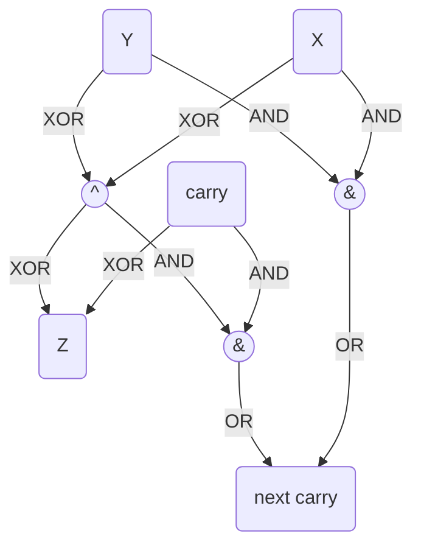

#### Part 1

For the first part we only evaluate all of the gates and recreate the number.

#### Part 2

For the second part it is somewhat easier to look up by hand. There are three easy candidates with `z` values. next you may recreate a mermaid diagram by using regex `([0-9a-z]+) ((?:OR)|(?:AND)|(?:XOR)) ([0-9a-z]+) -> ([0-9a-z]+)` and replace it by `\1 -- "\2" --> \4;\n\3 -- "\2" --> \4;`. next graph shows the labeling of the nodes.

